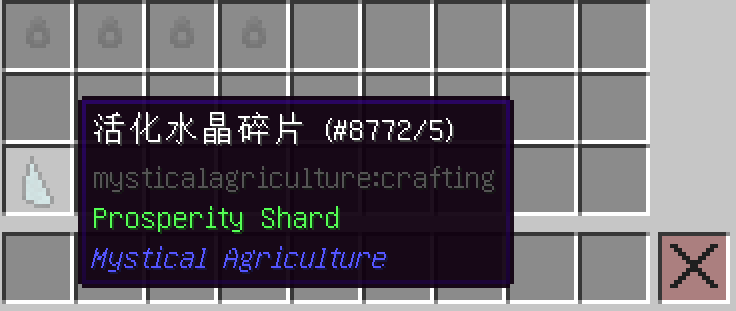
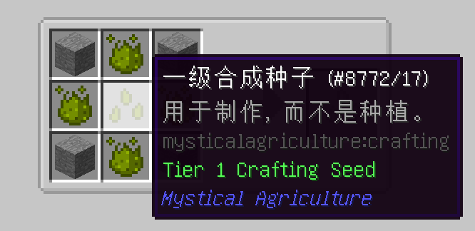
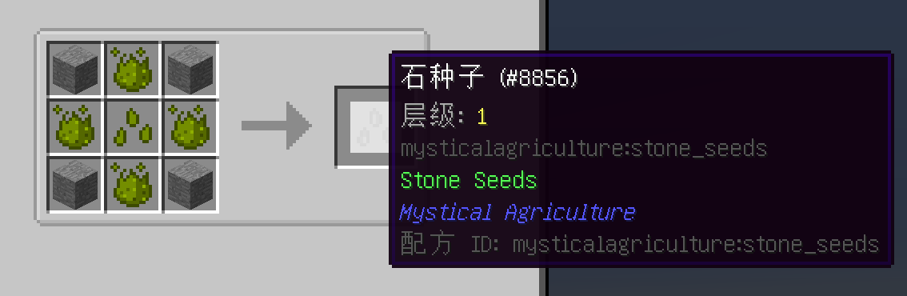

# 精华种子与精华
___

任意被杀的敌对生物都有20%的概率掉落下级精华。

下级，初级，中级，高级和终极精华都可用来制作各自层级的精华种子。

1级是使用杀怪获得的基础下级精华。

精华种子可以通过用下级精华包围普通种子来制作。

升级是通过用下一层级的精华包围上一层级的种子合成。

说到精华；这是升级每种精华的方法。

注魔水晶可以将多个精华浓缩到一个精华中。

注魔水晶的使用次数有限，灌注过多的精华后会损坏。

如果你获得了足够的终极精华，你就可以制作无法破坏的终极注魔水晶。

在地下挖矿时可以找到活化水晶碎片。它们可以用来制作基础合成种子，会是您未来种植种子的基础。

基础合成种子用来制作其他层级的种子。每一层级的合成种子都可以制作别的种子，让你可以种植有价值的资源，如煤，铁，甚至钻石。

正如我们在这个例子中看到的，用一些额外的下界精华和石头包围一级合成种子，就能制作出石头种子。

石头显然是一种早期游戏资源。石种子可以在游戏早期轻松获得，还有其他一些资源也是如此。在JEI菜单中搜索“@MysticalAgriculture”，就可以看到它们。

更高层级的种子的配方需要更高等级的精华所的制作合成种子。

钻石种子作为5级种子，需要相当多的终极精华来制作。
___

# 步入正轨
___

如果你真的想速通这个MOD，那就去耕种那珍贵的法罗钠吧，这里是耕作的方法。

你将需要以下物品：
-32个种子
-256个下级精华
-32个沃土（但你会想得到更多，这样你以后就可以种更多的种子了）
-2个富饶莲叶（他们很重要，但不是必须的）
-2套洒水器系统

第一步：制作下级精华种子。你最终需有32个下级种子。

第二步：把你的种子种到沃土上。确保它们有光源。

第三步：把你的富饶莲叶放在农场中间的某个地方。它们需要放在一个水源方块上，因此你需要为了莲叶放弃一块耕地。

第四步：建立2套洒水器系统，确保它们可以浇你的农场中的所有地方。

第五步：增强你的收集系统。这看你怎么想。反正我在我的生存中是手动收集所有农作物。

第六步：一旦你收集到了大量的下级精华，就可以开始升级它们了。有了这些，就可以制作更高层级的精华种子了。更高层级的精华种子每次收获的精华会更多。

注意：所有层级的精华种子都只能种出下级精华。只是数量变多了而已。

