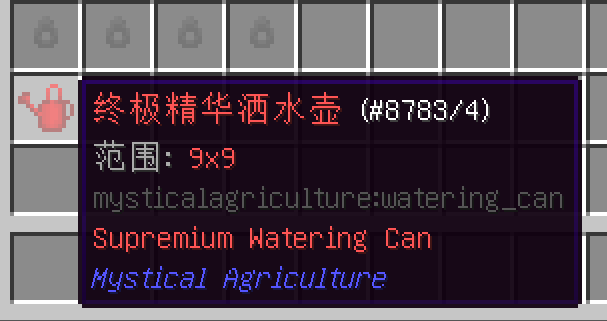

# 其他物品指南
___

洒水壶是非常有用的。使用它们能使区域内作物生长速度提高。

为了物尽其用，你应该拼命点击右键。

有个不需要那么麻烦的替代方法，你可以在该区域内看向地面移动，并按住右键。

当按住右键移动时，你经过的每一个方块会被注册为一个新的右键，并在你移动时自动使用洒水壶；如果这有任何意义的话。

洒水壶核心需要肥料精华。当你收获神秘农业的资源作物时，有概率获得它。

如果您有足够的资源，注入精华的煤炭也是一个巨大的福音。这种燃料的燃烧能力比普通煤炭强得多。

同样你也可以压缩你的燃料，就像普通的煤一样，但是多了点颜色。

种子再处理器可以将你的资源种子变回相应层级的基础合成种子。

当你要改变你所种植的作物，并且有改变种子的材料，但没有制作新的基础合成种子的材料时，你会需要它。

在游戏初期甚至游戏后期时都非常有用，当你种植了一到两种五级作物，并且你认为你已经得到足够的资源后，想把它们交换，你也会需要它。

