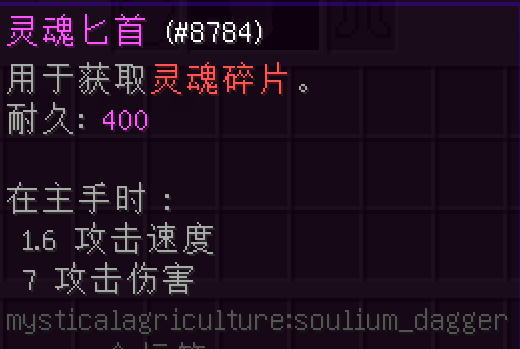
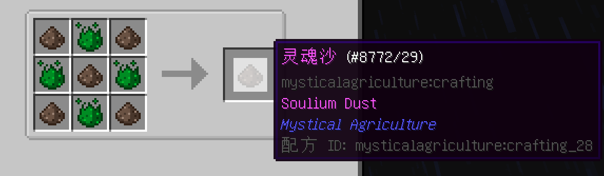
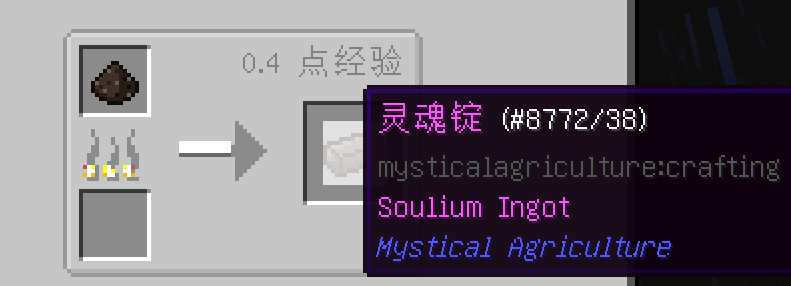
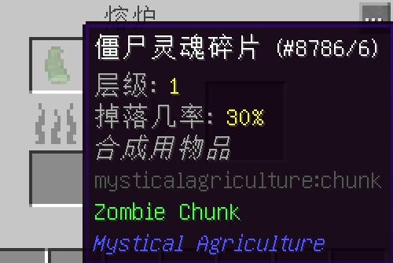
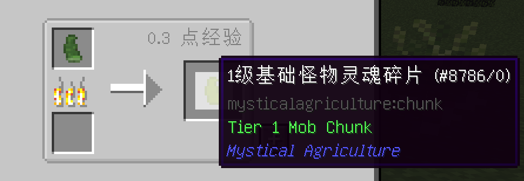
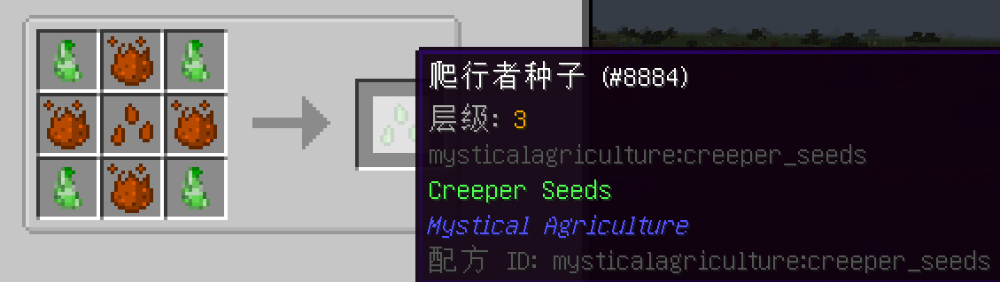

# 小匕首，大收获
___

灵魂匕首

你只能通过此物品获得怪物灵魂碎片。

使用该武器杀死生物，会有概率获得怪物灵魂碎片。灵魂碎片的类型取决于被杀死的生物。

第一步：制作灵魂锭。这是一个痛苦且套娃且不必要的过程。

获得石头（烧制过的圆石）和灵魂沙。

烧它。

获得初级精华并与灵魂沙合成。

烧制它。然后你就获得了制作灵魂匕首所需的灵魂锭！

但是等等，怎么没有刀柄!

你需要一些活化水晶碎片和一根木棍。

将以上所有东西组合起来，就能获得灵魂匕首！

现在你可以去击杀敌人，以获得怪物灵魂碎片！

灵魂碎片层级如下：

-僵尸是1级怪物基础灵魂碎片。

-农场动物为2级。

-主世界生物为3级。

-大多数下界生物为4级。

-凋灵骷髅为5级。

你可以烧制怪物灵魂碎片，以获得对应层级的基础怪物灵魂碎片。

如图所示，通过一个僵尸灵魂碎片，得到一个1级基础怪物灵魂碎片。

有了基础灵魂碎片，我们可以将它制作成其他生物的种子。然而，由于僵尸是你在第1级唯一可以“种植”的怪物，所以这个例子就不那么恰当了。

在2级怪物碎片的情况下，你可以使用基础灵魂碎片来将羊碎片变成牛碎片

注意：每一种碎片独立掉落的概率不同。

正如你所看到的，这是正在制作爬行者种子。

请注意，爬行者种子需要中级精华才能制作。

爬行者种子是三级的种子，需要三级精华才能制作。

这适用于所有种子和它们的层级。
