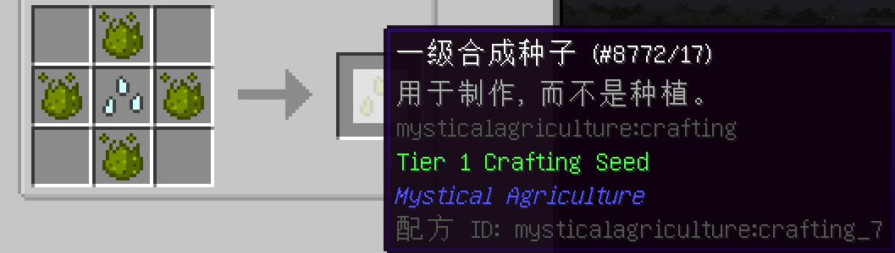
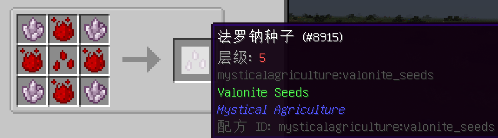
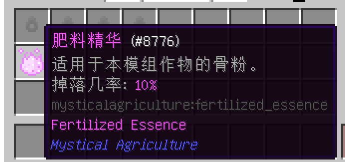

# 资源，及如何种植资源
___

# 初学者
___

你可以利用神秘农业种植大量不同的资源。

在上一节中，你学到了如何高效获得精华并物尽其用。在这一节中，你将学到如何将这些精华转变成资源种子。

合成种子有几个层级，最高为5级

基础合成种子需要从第1级开始升级。

收获一级合成种子会获得精华。然而，这些都不是普通的精华，它们可以被用于某些配方中，以制作资源。

在这里，我们看到可以通过一级合成种子获得的精华。

精华可以组合起来，创造出像泥土或草方块这样的东西。其他资源如石头，甚至煤炭都可以通过这些精华创造。
___

# 严阵以待
___

你最终将能够制作出能够生长出有价值材料的种子。

有些作物不会产生精华。大多数矿石作物会在收割时掉落自身。

在某些情况下，时运会影响掉落概率。

当附魔时运的工具破坏作物时，有概率掉落双倍掉落物，而你每次都必须重新种植你的农作物。

长远来看，建立一个可持续发展的农场是更有效的，它将为你带来持续的精华产出，来自于精华或合成种子作物。
___

# 给神秘作物施肥？
___

你可能一直想知道为什么普通的骨粉对精华不起作用，这是设定的游戏机制。

要想给神秘农业的农作物施肥，你需要获得肥料精华。

在收获任何资源作物时，有10%的概率掉落肥料。

肥料精华可以像骨粉一样用于神秘农业的作物。

它还可以用来制作该模组中的其他杂物。更多信息请参见杂项物品部分（译者注：这个作者根本没做这个部分）。