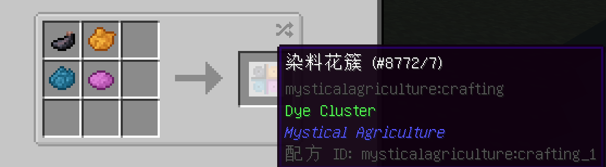
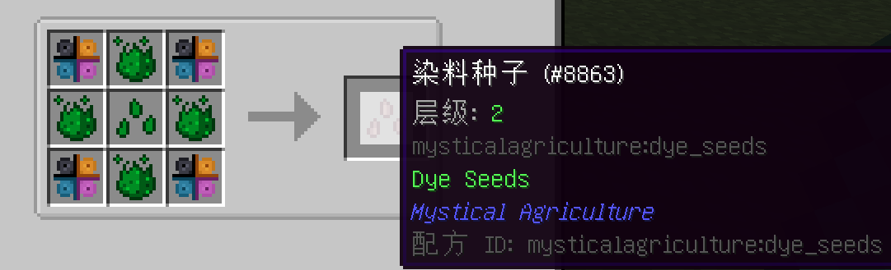
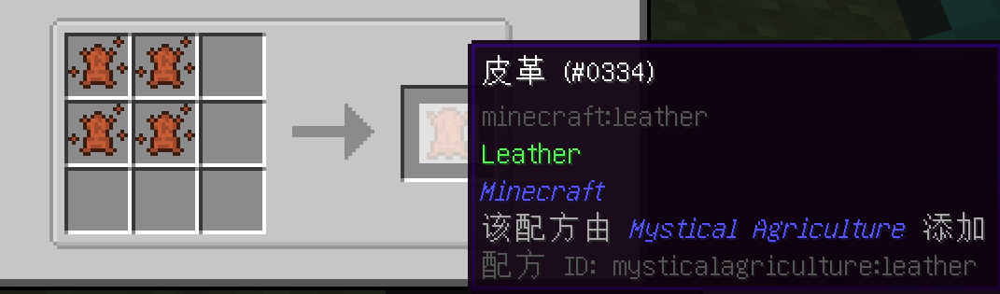
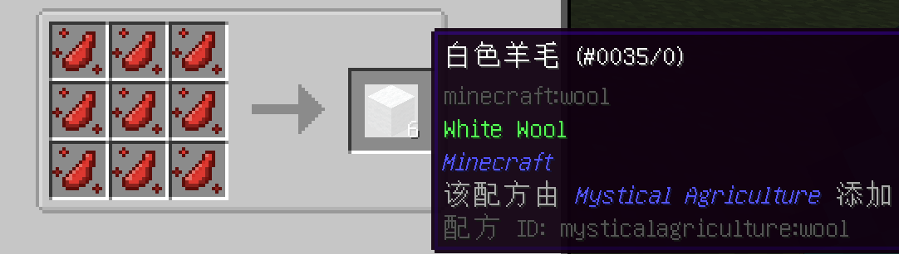

# 最佳作物
___

1 - 染料种子

你需要一些染料花簇制作种子。

不幸的是，制作这些花簇的配方需要染料。

之后，你可以把所有的东西和一些初级精华结合在一起，创造染料种子。

有了这些种子，你可以制作基础染料。有了基础颜色，你就能使用不同的组合创造出更多颜色，这样就不必再为收集鲜花而烦恼了！

请务必查看JEI菜单，以了解如何将染料精华制作成不同颜色。

2 - 牛和羊种子

牛精华是一个很好的皮革来源，使没有那么多的牛占用你基地周围的空间。

羊精华也是如此，它可以作为羊毛的可靠来源。

你可以用羊毛用于建筑，或将其分解成线用于其他配方。

3 - 僵尸和骷髅种子

僵尸精华可以成为一个不错的腐肉来源。腐肉可用于几种配方，包括制造皮革和某些低级食物。

然而，腐肉最重要且经常被忽视的用途是制作沃土。就目前而言，沃土是种植农作物最有用的方块；但大量制作的成本相对昂贵。

这就是你天然的腐肉来源！

对于少数需要骨头而不是骨粉或其他东西的重要配方来说，骷髅精华是一个重要的骨头来源。

你不太需要很多这种作物，但这不是这种精华最有价值的配方！。

骷髅精华也可以用来制造头颅。

头颅可以放在地牢战术的守护者方块上，或用于其他重要的配方，如坟墓和墓碑以及预制建筑的怪物磨床。

一旦你获得了5级资源种子，你就可以种植凋灵骷髅精华，并将其与空白头骨相结合，成为凋灵骷髅头颅的可靠来源。

4 - 守卫者和恶魂种子

在整合包中，有两种最难以捉摸的生物；你肯定会想囤积这些物资。

在OTG地形生成中，从出生点开始的数千格都可能看不到海洋。为了缓解这个问题，如果你哪怕是能获得很少的的守护者材料，你就可以开始你的资源农场。

守卫者精华可以用来制作海晶碎片碎片和海晶砂粒！

你甚至可以用精华制作鱼！

恶魂精华是获得恶魂之泪的一种方式。

在几个强大的配方以及炼药的使用中非常重要，这是你需要的种子。

5 - 烈焰人种子

我甚至不用解释烈焰棒的重要性。特别是在这个整合包中。它们被用于大量重要和强大的配方。

6 - 重要的矿石种子

煤，铁和金都是重要的种子，如果你能找到一块好的土地来种植它们。它们将成为你一个重要的基础材料来源。

从长远来看，你在这个整合包中消耗的煤、铁和金的数量绝对是被低估的。

如果可能的话，像琥珀和水银这样的稀有材料也应该大量种植。

这些物品对于像神秘时代这样的模组来说是非常重要的。琥珀也是一个不错的装饰方块。

神秘锭和虚空金属锭在坩埚中冶炼时会产生灵气。

有机地种植它们规避了坩埚会出现的问题。

来自交错次元的矿物也应该被种植。交错次元的地下矿石密度并不高。

种植这些种子中获得的材料应该会丰富你的资源库。

暮色森林的钢叶和骑士金属等材料并不常见；钢叶实际上只能在暮色森林的箱子里找到，数量实在有限。

种植这两种材料应该可以帮助你获得它们，直到你对你拥有的数量感到满意。

当你需要修复你的主要装备时，或者你已经死亡并需要从坟墓中重新获取物品时，钢叶是一个很好的备用盔甲。

翡翠，由于它的罕见程度令人发指，在你的资源库也应有一定储备。

当你挖地三尺寻找这块绿色宝石时，混沌之地和它的大量虫子从未放弃过试图杀死你，所以当你可以在自家后院种植时，你为什么要给虫子吗们机会？

