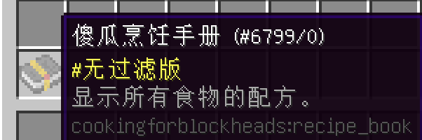
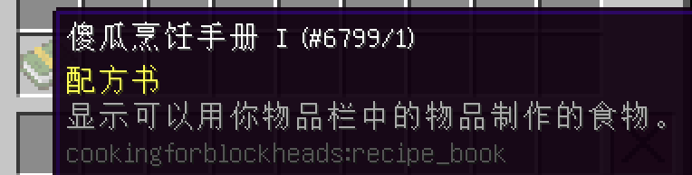
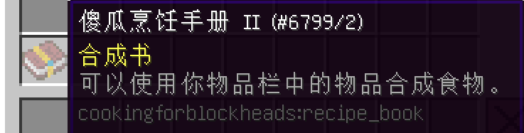

# 祖母的食谱
___

你获得的第一本食谱将向你展示所有可用的烹饪食谱。

就这样。

回到厨房吧！

第二本食谱将向你展示你可以用物品栏的物品制作的所有食谱。

就这样。

回到厨房吧！

第三本食谱将向你展示你可以用物品栏的物品制作的所有食谱，并允许你从物品栏中制作它们。

这一点略有限制，因为你不能从你的物品栏中烹饪食物。

这本食谱限制了你准备9x9的物品，而且只能用你已经有的物品，或你可以从你的物品栏制作的物品。

因此，你还是应该留在厨房里！