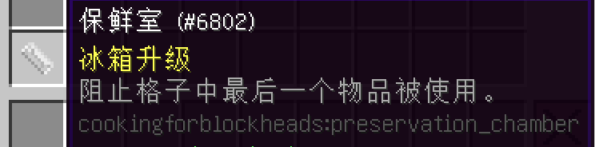

# 厨房及如何运作
___

注：为了缩短模组名“懒人厨房”，我们将把厨房物品称为 "厨房方块"。

厨房可能很复杂，但不一定非得如此！

如果我需要说得简短一点，地面上的厨房方块如果没有连接到你大部分的食物存储，需要由厨房地板连接。

首先，你的厨房方块的许多部分可以用来储存食物。

这就是说，为了将容器的物品栏与你的食品加工站联系起来，你必须让每个容器相互接触，要么是边对边，要么是角对角。

在厨柜的情况下，该方块需要在你的加工站上方一到两格。当它被放置在一定范围之外时，它似乎不起作用，但当靠近另一个加工站或厨房方块储物方块时，它将链接物品栏。

如果是烤箱，你需要用煤供能。然而，如果烤箱和其他容器之间的物品栏联系看起来很奇怪，这里有简短的细节。

这个冰箱里确实有生鸡肉......所以我需要烹饪鸡肉。

只要有燃料就可以燃烧，你就可以在烹饪桌上制作你需要的一切。如果烹饪桌中有燃料，而链接的容器中有生鸡肉，熟鸡肉的配方会出现在烹饪桌中。点击一次就可以选择该配方。进一步将把生鸡肉从它所在的地方移到炉子里进行烹饪。

然后，必须手动移动熟鸡肉，或者可以直接从烤箱中取出，用于烹饪桌中的其他配方。

注2：只要物品栏有关联，你就可以在厨房的任何地方做任何事情。

注3：所有的厨房方块物品都会将物品栏链接在一起。

从上面的基础图片中可以看出，所有的方块都放在厨房地板上。这将把所有地面方块的物品栏联系在一起。

然而，你还可以看到地面方块上方的架子。这些将连接厨柜（因为它们在其他厨房方块上方连接了一到两个方块）。把架子看成是一种预防措施，以确保所有物品栏完全联系在一起。

这样，你就不会找不到或忘记你手头的任何材料了！

在这个整合包中，烹饪是多么的重要，如果你真的喜欢烹饪，例子中的厨房是无法满足你的要求的。

去找一个使巨大的厨房仍然具有美感的解决方案！

# 厨房用具
___

厨房里有几种工具，你需要制作并随时准备好。如果你一开始就做了一整套厨具，你就不必再做一次了。

厨具可以从厨房方块容器中使用，也可以在连接到厨房物品栏的厨具架上使用。

图中的厨具从左至右依次名为：

-刀砧板；这个物品可以作为一个装饰方块，放在一个方块的顶部；工具的使用将被连接起来。

所有其他物品必须存放在链接的物品栏中，或存放在一个架子上（这也是一个链接的物品栏）。

-锅
-平底锅
-深平底锅
-烤盘
-研钵与研杵
-搅拌钵
-榨汁机

总共有8个厨具。

其他2件物品可以算作厨具。

吐司机是用来手动烤面包的。这比把面包放在熔炉里更慢。这是一个不错的装饰品。吐司机会给予潘马斯农场的吐司。

第二个物品，罐中奶牛，当它在一个厨房方块的顶部与之相连时，将为需要它的食谱提供牛奶。牛奶罐只能储存牛奶，看起来是这样。

建议在一个罐子里制造多头奶牛，以便创造更多的牛奶。1桶=1000毫升的牛奶。

# 升级？对于厨房方块？Waaaaaaaaaaaaaaaaaaaaa
___

要使用升级，请右键各方块。

这个升级允许你使用FE能量为你的烤箱供电，以节省煤炭。你可以用通灵线圈，或电池，或其他任何你能想到的能源连接为你的烤箱供电。

这种升级将使最后一格物品被保存，并被提取出来。

这一升级将使你的冰箱能够为任何需要它的配方生产雪和冰。

例如:如果有一组多脂奶油和一组盐，而你想制作黄油，这个升级将阻止你使用所有材料，只允许你的烹饪站制作63个黄油。

如果你像我一样，经常自己手动分类，那么就可以方便地将物品快速存入你的冰箱。
