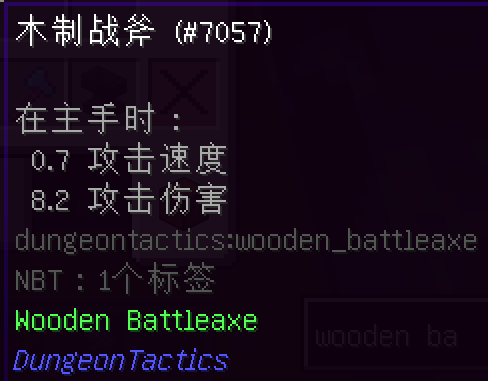
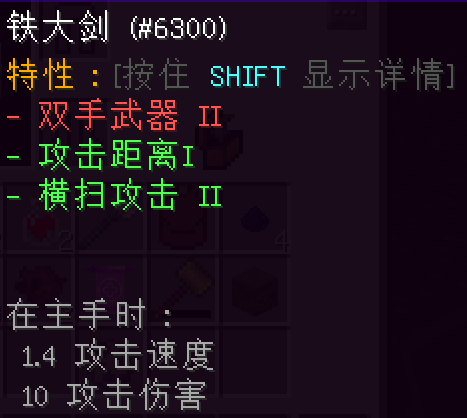
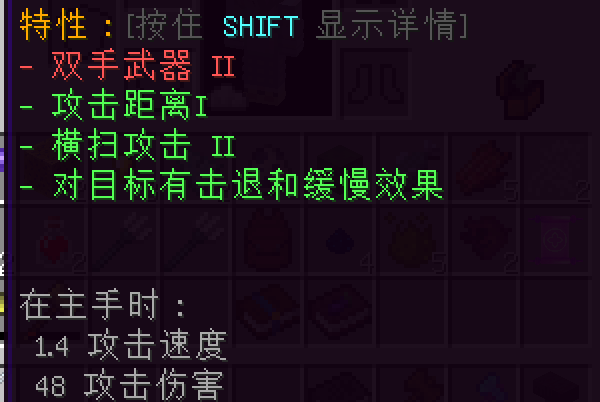
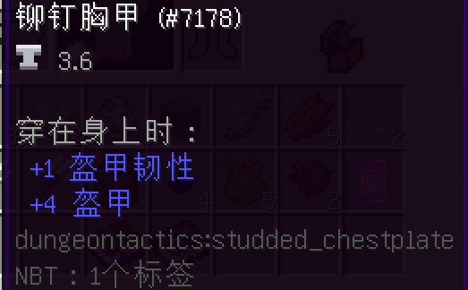
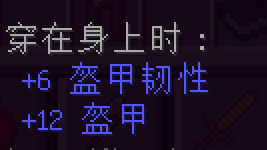

# 获得像样的武器和盔甲！

在整个冒险过程中，你将与很多强大的敌人战斗。

你从一开始就应该准备好！

除了像镐、斧和锹这样的基本工具外，你还需要一个牢靠的武器！

虽然攻击速度低于钻石剑，但木制战斧的伤害比每个人的梦寐以求的武器多出1.2点伤害，真令人吃惊。

这个物品应该能帮助你在早期游戏中击败敌人，直到你能够获得更可靠的武器。如果你正在寻找更好的采矿或居住地点，你实际上只会拥有这个武器大约10到15分钟。

铁大剑是你从木制战斧直接升级而来的武器。拥有更高的攻击速度和1.8点额外伤害，这个物品将在你面对越来越大的困难时给予你很大的帮助。

你有时可能会获得随机战利品或超级战利品的战利品箱。这些模组是独立的，并且有独立的方块来修复它们的物品。请牢记这一点。

抛开这一点不谈，每件工具，或模组的盔甲都有特殊的效果。如果投入时间和资源，这些物品可以变得非常强大，特别如果你是欧皇，会更容易得到宝贝。

总是有玩家问，哪个模组的装备更好。平均而言，来自超级战利品的物品一直比较强大。然而，随机战利品也有不少有用的物品，你可能会有幸得到。

两个模组的战利品箱都可以从商店购买，或者通过探索主世界或战斗高塔找到。

请注意：来自随机战利品的盔甲有问题，升级后会失去其效果和状态。这是一个已知的bug。它无法被修复。

龙钢大剑（霜钢或炎钢）是游戏中最强大的武器，可以直接使用工作台制作。

在进一步的冒险过程中，你将可以获得龙钢武器和盔甲。

参见冰火传说指南或参考你的异兽手记以了解更多关于龙骨的信息。

如果你在游戏早期无法获得大量的铁，或者想节省一些资源，那么铆钉装备是全套铁甲的最佳替代品。

最后，在整套铁甲上制作铆钉将为你节省约10个锭。

超级战利品的盔甲非常强大，甚至在穿戴部分套装时还会有额外的效果。这使得玩家可以在冒险中装备其他辅助装备，给予其更高的灵活性。

有些盔甲甚至可以赋予飞行能力！

有些盔甲的属性甚至比龙钢还要好！

如上所述，超级战利品的箱子可以从商店购买。

在这个整合包中，龙钢盔甲的基础属性是最好的。

如前所述，请查看冰与火指南或参考你的异兽手机，以了解更多关于如何获得龙钢的信息。

