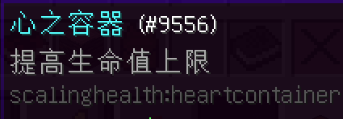

# 地球不是绕着你转！

你的世界的难度将逐渐增加，直至250。

难度由几个常数和几个加法变量增加。

你离出生点越远，难度增加的速度越快。

击杀生物也会增加难度。

随着难度的增加，生物的血量和伤害以及产生凋灵生物的概率也会增加。

蕴魔和诅咒之心可以用来降低或增加你世界的难度。它们可以从商店购买。控制世界的难度并不容易，这些心将花费相当多的钱。

用完成任务获得的金币购买它们!

心之容器可以通过在你的工作台中使用心晶碎片来制作。请看JEI菜单中的配方。

这些红心将使你的最大生命值增加1颗心，有一定的经验值消耗。

此外，最大生命值是重要的东西，所以不要担心血量太多。

击杀敌人会随机掉落心晶碎片，在地下也能找到很少的矿脉。

